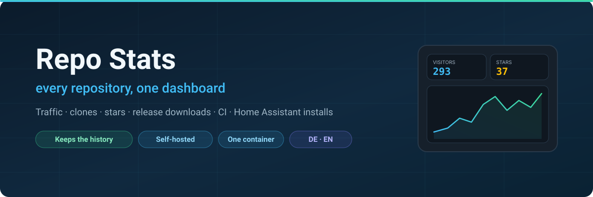
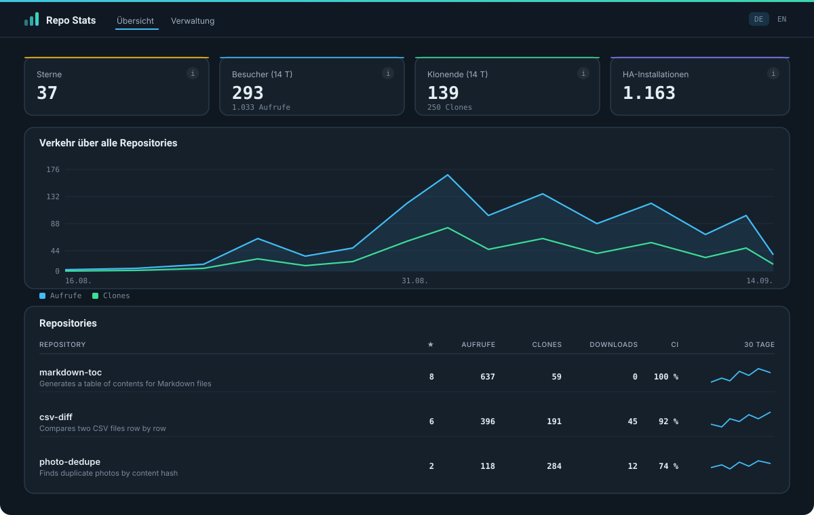

<div align="center">



# Repo Stats

**Ein selbst gehostetes Dashboard für alles, was GitHub über die eigenen Repositories weiß — und für die Zahlen, die es nach zwei Wochen wegwirft.**

*[English version](README.md)*

[](https://github.com/sphings79/repostats/actions/workflows/docker.yml)
[](https://github.com/sphings79/repostats/actions/workflows/check.yml)
[](https://github.com/sphings79/repostats/pkgs/container/repostats)
[](LICENSE)
[](https://github.com/sphings79/repostats/stargazers)

</div>

---

GitHub zeigt den Verkehr pro Repository, für vierzehn Tage, ein Repository nach
dem anderen. Es gibt keine Übersicht über mehrere, keine Historie und nirgends
eine Download-Zahl. **Repo Stats sammelt alles in einer SQLite-Datei und
zeichnet es** — selbst gehostet, in einem Container, im eigenen Netz.

<div align="center">



</div>

## Inhalt

- [Wozu das gut ist](#wozu-das-gut-ist)
- [Was drin steht](#was-drin-steht)
- [Betrieb](#betrieb)
- [Einstellungen](#einstellungen)
- [Hinter einem Reverse Proxy](#hinter-einem-reverse-proxy)
- [Wie es arbeitet](#wie-es-arbeitet)
- [Fragen](#fragen)
- [Mitmachen](#mitmachen)

## Wozu das gut ist

**GitHub löscht die Verkehrsdaten nach vierzehn Tagen.** Aufrufe, eindeutige
Besucher, Clones, Herkunft — weg, ohne Möglichkeit sie zurückzuholen. Wer
wissen will, ob der Beitrag von letztem Monat tatsächlich jemanden gebracht
hat, findet die Antwort nicht mehr vor.

**Es gibt keine Sicht über mehrere Repositories.** Bei fünfzig Repositories
heißt „woher kommen meine Besucher" fünfzig Mal Insights öffnen.

**Release-Downloads zeigt GitHub gar nicht.** Die Zahl wird pro Datei geführt
und in der Oberfläche nirgends angezeigt.

Ein täglicher Sammellauf löst alle drei Punkte. Jeder Lauf liefert das
komplette Vierzehn-Tage-Fenster — Ausfälle unter zwei Wochen heilen sich damit
von selbst.

## Was drin steht

**Über das Konto** — Sterne, Forks, Beobachter, offene Issues,
Release-Downloads, Besucher und Clones über alle verfolgten Repositories, woher
die Besucher kommen und wie sich das über die Zeit bewegt.

**Pro Repository** — dieselben Zahlen im Detail, dazu Mitwirkende, Commits,
offene und gemergte Pull Requests, Erfolgsquote und Dauer der CI-Läufe, die
meistbesuchten Seiten, Downloads je Release-Datei und die offenen Issues samt
Links.

**Eine Sternkurve bis zum ersten Stern**, rekonstruiert aus den Zeitstempeln
der einzelnen Stargazer — die Historie steht also schon nach dem ersten Lauf
zur Verfügung, statt bei null anzufangen.

**Für Home-Assistant-Integrationen** die Installationszahl von
`analytics.home-assistant.io`, aufgeteilt nach Version: Eine Integrations-Domain
gehört allen, die sie ausliefern, und gezählt werden nur die Versionen, die aus
dem eigenen Repository stammen.

Jede Kachel öffnet eine Aufschlüsselung, aus welchen Repositories die Zahl
besteht, und jede trägt eine Erklärung, was sie tatsächlich zählt — denn
„2.592 Clones" heißt meistens: die eigene CI, nicht Menschen.

## Betrieb

```bash
git clone https://github.com/sphings79/repostats.git
cd repostats
cp .env.example .env     # Token und Konto eintragen
docker compose up -d
```

Dann `http://<host>:8377` öffnen, anmelden, unter *Verwaltung* die
Repositories auswählen und *Jetzt alles sammeln* drücken.

Das Image wird für **amd64 und arm64** veröffentlicht, auf dem eigenen Host
wird also nichts kompiliert. Die Daten liegen als eine SQLite-Datei in einem
Volume — ein Backup ist eine Dateikopie.

## Einstellungen

| Variable | Vorgabe | Bedeutung |
|---|---|---|
| `GITHUB_TOKEN` | — | Persönliches Zugriffstoken, erforderlich |
| `GITHUB_LOGIN` | — | Das Konto, das gesammelt wird, erforderlich |
| `AUTH_USER` | `admin` | Benutzer für die Anmeldung |
| `AUTH_PASSWORD` | — | Passwort; leer schaltet die Anmeldung ab |
| `GITHUB_TOKEN_STARS` | — | Klassisches Token mit `public_repo`, für die Sternhistorie |
| `PORT` | `8377` | Port auf dem Host |
| `FULL_RUN_HOUR` | `4` | Stunde (UTC) des täglichen Komplettlaufs |
| `QUICK_RUN_MINUTES` | `60` | Wie oft die günstigen Zähler aktualisiert werden |

**Das Token braucht die passenden Rechte**, und eines davon übersieht man
leicht:

- Fein granuliert: Lesezugriff auf **Administration** (das schaltet die
  Verkehrszahlen frei), Contents, Issues, Metadata, Pull requests und Actions
  für die CI-Zahlen.
- Klassisch: der Scope `repo`.

**`AUTH_PASSWORD` sollte gesetzt sein**, außer es läuft kurz auf dem eigenen
Rechner. Hier stehen die privaten Repositories, und im Container liegt ein
Token, das sie alle lesen kann.

**Die Sternhistorie braucht ein zweites Token.** GitHub weist fein granulierte
Tokens am Stargazer-Endpunkt ab, über REST wie über GraphQL, und anonym gibt es
dort nichts. `GITHUB_TOKEN_STARS` nimmt ein klassisches Token mit
`public_repo`; getrennt gehalten heißt: Das Haupttoken braucht nirgends
Schreibrechte. Ohne das Token beginnt die Sternkurve beim ersten Sammellauf.

## Hinter einem Reverse Proxy

`docs/traefik.yaml.example` zeigt eine Route mit zwei Schlössern: auf das
eigene Netz beschränkt, und die Anmeldung des Dashboards obendrauf.
`compose.override.yaml.example` hängt den Container ins Proxy-Netz, ohne einen
Port zu veröffentlichen.

## Wie es arbeitet

Ein Container, eine SQLite-Datei, keine fremden Dienste.

- **Stündlich** — die günstigen Zähler: Sterne, Forks, Beobachter,
  Release-Downloads.
- **Täglich** — alles andere: Verkehr, Herkunft, meistbesuchte Seiten, Issues,
  CI-Läufe, Mitwirkende, Commits, Home-Assistant-Installationen.

Die Diagramme sind serverseitig erzeugtes SVG. Keine Chart-Bibliothek, kein
Build-Schritt, kein CDN — die Seiten rendern von selbst und funktionieren auch
offline.

Nach außen gehen nur Anfragen an die GitHub-API und an die
Home-Assistant-Statistik.

## Fragen

**Warum sind meine Clone-Zahlen so hoch?**
Weil die meisten davon Maschinen sind. Jeder `actions/checkout` in einem
Workflow ist für GitHub ein Clone — bei einem Matrix-Build einer pro Job. Dazu
kommen Bots und Spiegeldienste. Deshalb steht in der Kachel die Zahl der
unterschiedlichen Klonenden vorn und die Rohzahl klein darunter.

**Warum zeigt eine Integration Installationen, die ich nicht kenne?**
Home Assistant meldet pro Integrations-Domain, und die gehört allen, die diese
Integration ausliefern. Repo Stats teilt die Zahl nach Version auf und zählt
nur die Versionen aus dem eigenen Repository.

**Geht es ohne Token?**
Teilweise. Sterne, Forks und Downloads sind öffentlich. Verkehr und Clones
nicht — dafür braucht es ein Token, und genau deshalb läuft das serverseitig.

**Kann es fremde Repositories beobachten?**
Nur für die öffentlichen Zahlen. Den Verkehr sieht ausschließlich der
Eigentümer.

**Funkt es nach Hause?**
Nein. Keine Telemetrie, keine Statistik, keine Update-Prüfung.

## Mitmachen

Issues und Pull Requests sind willkommen — besonders für Zahlen, die noch
fehlen.

Wenn dir das fünfzig Insights-Seiten erspart, hilft ein ⭐ anderen, es zu
finden.

<a href="https://buymeacoffee.com/sphings"></a>

## Lizenz

MIT — siehe [LICENSE](LICENSE).

---

<sub>GitHub Statistik Dashboard · Repository-Analyse · Verkehrshistorie ·
Clone-Zähler · Sternverlauf · Release-Downloads · selbst gehostet · Docker ·
FastAPI · SQLite · Home Assistant Analytics</sub>
